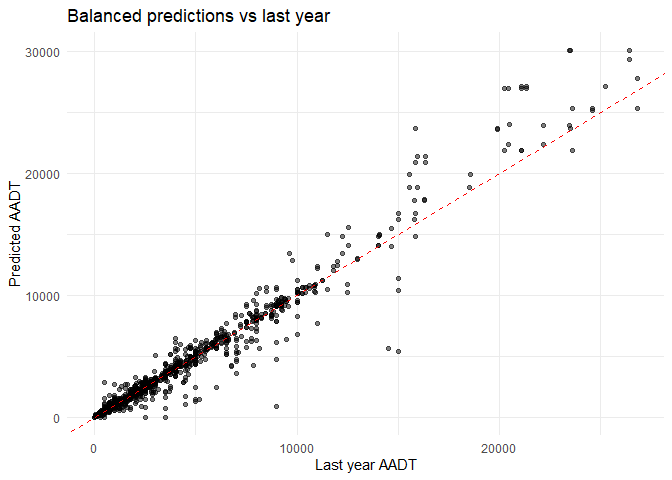
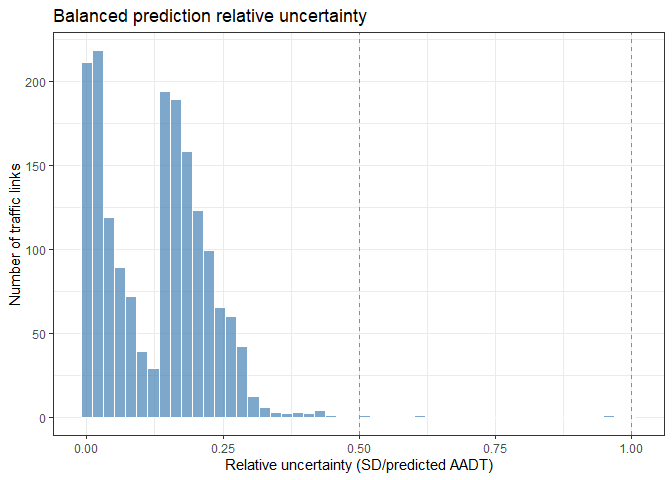

<!-- README.md is generated from README.Rmd. Please edit that file -->

# xdtkit

<!-- badges: start -->

<!-- badges: end -->

The goal of xdtkit is to make available functions for predicting AADT
(annual average daily traffic) on the Norwegian road network.

## Installation

You can install the development version of xdtkit from GitHub with:

``` r
# install.packages("pak")
pak::pak("trafikkdata/xdtkit")
```

## Example

The AADT modelling process requires some fairly large datasets that are
not publicly available and are too large to include with the package. To
show how the package should be used, we have included data from only
Buskerud.

Code for running the full AADT model can be found in the repository
[xdt-modelling](https://github.com/trafikkdata/xdt-modelling).

### Data preparation

We start by loading the package and specifying the year for the data.

``` r
library(xdtkit)
year <- 2025
```

Next, we will load and prepare all the data, and compute the adjacency
matrix used in the INLA-step and the traffic link clusters used in the
balancing step.

We first load the Buskerud traffic links, these are included in the R
package.

``` r
# Traffic links: Load and preprocess
preprocessed_traffic_links <- preprocess_traffic_links(buskerud_directed_traffic_links, year = year)
```

We also join the bus counts to the data set that contains information
about which bus stops are connected to which traffic links, so that for
the traffic links that have only public transport lanes, we can use the
average number of buses that stops there as the AADT value. There are
149 such traffic links in all of Norway in 2025, though in Buskerud
there is only 1.

``` r
# Bus data: Load and preprocess
bus_aadt <- calculate_bus_aadt(stops_on_traffic_links, bus_counts, year = year)
```

Notice that many of the columns in the directed traffic link data set
are missing values.

``` r
missing_counts <- colSums(is.na(preprocessed_traffic_links))
missing_counts[missing_counts > 0]
#>               functionClass                    maxLanes 
#>                          18                           1 
#>                    minLanes hasOnlyPublicTransportLanes 
#>                           1                           1 
#>           lastYearAadt_aadt     lastYearAadt_heavyRatio 
#>                           1                           1 
#>      lastYearAadt_heavyAadt                        aadt 
#>                           1                        1129 
#>                    coverage                  heavyRatio 
#>                        1129                        1460 
#>                   heavyAadt       traffic_volume_source 
#>                        1460                        1129 
#>         traffic_volume_year 
#>                        1129
```

For the INLA model, any missing covariate values will be replaced by 0,
which is often not a good idea. So instead we fill in the missing values
in a few different ways, depending on the type of variable. For the
categorical variables, we create an “unknown” category, as these are
often missing in similar places (private or municipal roads). For the
logical column `hasPublicTransportLanes`, we assume that missing entries
do not have only public transport lanes. For the numerical columns, we
fill missing values by the median for that column. In addition, we
remove any negative values and treat them as if they don’t have data,
and add `logLastYear` as a transformed variable, and we join in the bus
data.

``` r
# Fill missing values and add bus data
prepared_traffic_links <- fill_missing_values(
  df = preprocessed_traffic_links,
  unknown_impute_columns = c("functionClass", "highestSpeedLimit", "lowestSpeedLimit","maxLanes", "minLanes"),
  mode_impute_columns = c("hasOnlyPublicTransportLanes"),
  median_impute_columns = c("lastYearAadt_aadt", "lastYearAadt_heavyRatio", 
                            "lastYearAadt_heavyAadt")) |>
  remove_negative_aadt() |> 
  add_logLastYear() |>
  join_bus_to_traffic(bus_aadt)

missing_counts <- colSums(is.na(prepared_traffic_links))
missing_counts[missing_counts > 0]
#>                  aadt              coverage            heavyRatio 
#>                  1129                  1129                  1460 
#>             heavyAadt traffic_volume_source   traffic_volume_year 
#>                  1460                  1129                  1129 
#>          stopPointRef         stopCertainty 
#>                  1774                  1774
```

Now only non-covariate columns are missing values.

Now we can build the adjacensy matrix. This is built based on the
traffic link data alone, since that data set has columns indicating the
start- and end-nodes. Using that information, we can identify the
neighboring traffic links.

``` r
# Adjacency matrix (may take several minutes to run)
adjacency_matrix <- build_adjacency_matrix(
  prepared_traffic_links,
  exclude_public_transport = TRUE)
#> Building adjacency matrix for 1774 links...
#> Finding adjacent links...
#> Building sparse matrix from 15018 adjacency pairs...
#> Excluding 1 public transport links...
#> Adjacency matrix complete: 13326 non-zero entries
```

We also calculate the balancing clusters. These are sub-groups of the
traffic links that are separated in the road network by traffic links
that have registration points. In this case, the number of traffic links
in Buskerud is so small that we could have just dropped this step, but
when running the model on all of Norway we need to separate into these
clusters to be able to run it at all (because of memory limitations). So
in this case, there will probably not be many sub-clusters, but we
include it in order to illustrate what the full workflow will look like.

``` r
# Balancing clusters
clusters <- strategic_network_clustering(
  data = prepared_traffic_links,
  year = year, 
  boundary_links = c("Trafikkdata_continuous"))
#> Joining with `by = join_by(parentTrafficLinkId)`
#> Identifying mainland and island components...
#> Creating base clusters on mainland...
#> Merging small clusters...
#> Assigning barrier links to neighboring mainland clusters...
#> Assigning island components...
#> === Clustering Summary ===
#> Network Overview:
#> Total links: 955
#> Mainland: 954 links
#> Islands: 1 components, 1 links
#> Clustering Results:
#> Initial mainland clusters: 23
#> After merging: 1 mainland clusters
#> Total final clusters: 4 ( 1 mainland + 1 islands + 2 singletons)
#> Boundary Handling:
#> Duplicate assignments (boundaries): 0
#> Cluster Size Distribution:
#>    Min. 1st Qu.  Median    Mean 3rd Qu.    Max. 
#>     1.0     1.0     1.0   238.8   238.8   952.0
```

Finally, we load the traffic nodes for Buskerud, and add information on
which nodes are not balanceable, that is, which nodes do we not want to
enforce the condition that the number of incoming cars is equal to the
number of outgoing cars. Importantly, the node data contains information
about the legal turning movements from every incoming traffic link to
that node. All of this is used in the balancing step.

``` r
# Nodes: Load and preprocess (may take a minute to run)
nodes <- identify_unbalanceable_nodes(buskerud_nodes, prepared_traffic_links)
#> Joining with `by = join_by(id, roadSystems)`
```

### Inla model

Now that we have our data and adjacency matrix, we can run the INLA
model.

``` r
covariates <- ~ functionalRoadClass:maxLanes +
  functionalRoadClass:roadCategory +
  minLanes:roadCategory + functionalRoadClass +
  maxLanes + roadCategory +
  hasOnlyPublicTransportLanes + 
  functionalRoadClass*isRamp +
  lastYearAadt_logAadt

inla_model_total <- fit_inla_model(
  data = prepared_traffic_links,
  adjacency_matrix,
  fixed_effects = covariates,
  iid_effects = "roadSystem",
  family = "poisson")
#> Preparing data for INLA model...
#> Fitting INLA model with family = poisson...
#> Model fitting complete.

inla_model_total
#> INLA Traffic Model
#> ==================
#> 
#> Number of predictions: 1774 
#> Family:  poisson 
#> Formula: aadt ~ f(spatial.idx, model = "besagproper", graph = adjacency_matrix, 
#>     adjust.for.con.comp = FALSE, constr = TRUE) + f(roadSystem, 
#>     model = "iid") + functionalRoadClass + maxLanes + roadCategory + 
#>     hasOnlyPublicTransportLanes + isRamp + lastYearAadt_logAadt + 
#>     functionalRoadClass:maxLanes + functionalRoadClass:roadCategory + 
#>     roadCategory:minLanes + functionalRoadClass:isRamp
#> 
#> Use $summary for model details
#> Use $predictions to access predictions data frame
```

We join the predictions and their associated uncertainty to the traffic
link data.

``` r
predictions_total <- dplyr::full_join(prepared_traffic_links, inla_model_total$predictions)
#> Joining with `by = join_by(id)`
```

### Balancing model

Next, we balance the INLA predictions to ensure correct traffic flow,
and add the balanced results to the traffic links.

``` r
balanced_model_total <- balance_predictions(data = predictions_total,
                                            nodes = nodes,
                                            balancing_grouping_variable = clusters,
                                            nodes_to_balance = "complete nodes",
                                            year = year)
#> Balancing predictions for all groups... --------------
#>   Balancing predictions for group:  1 
#>     Building incidence matrix...
#>     Building measurement matrix...
#>     Creating Sigma_vb...
#>     Inverting Sigma_b...
#>   Balancing predictions for group:  2 
#>     Building incidence matrix...
#>   Balancing predictions for group:  3 
#>     Building incidence matrix...
#>     Building measurement matrix...
#>     Creating Sigma_vb...
#>     Inverting Sigma_b...
#>   Balancing predictions for group:  4 
#>     Building incidence matrix...
#>     Building measurement matrix...
#>     Creating Sigma_vb...
#>     Inverting Sigma_b...

predictions_total <- dplyr::full_join(predictions_total, balanced_model_total$balanced_res)
#> Joining with `by = join_by(id)`
```

And that completes the modelling workflow!

### Examining the results

``` r
plot_predictions_against_last_year(predictions_total)
```



``` r
plot_prediction_relative_uncertainty_histogram(predictions_total, cap_cv = 1)
#> Warning in plot_prediction_relative_uncertainty_histogram(predictions_total, :
#> 31 values (1.75%) exceeded relative uncertainty cap of 1.00 and were excluded
#> from plot
```


